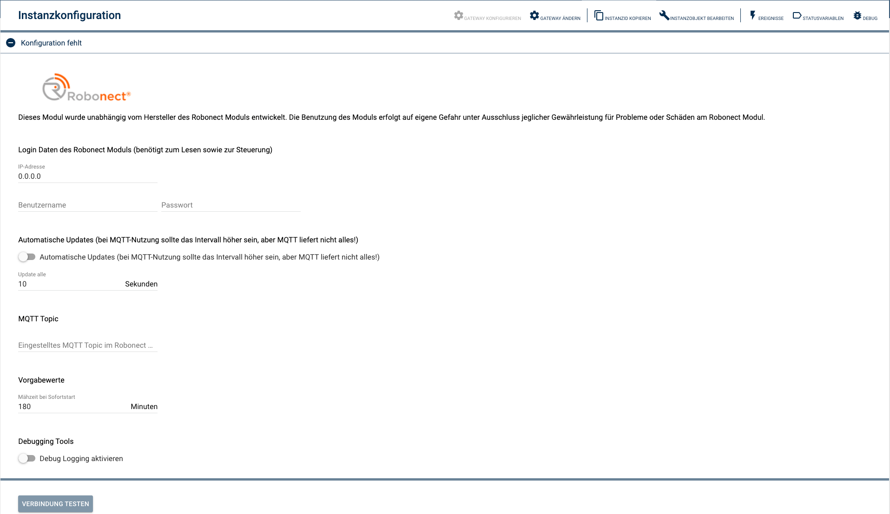

### IP-Symcon Modul zur Einbindung eines mit einem Robonect-Rasenmäher-WLAN Modul erweiterten, Mähroboters


PHP-Modul zur Einbindung von [Robonect](https://www.robonect-shop.de)-WLAN Modulen zur Steuerung eines Mähroboters.

Nutzung auf eigene Gefahr ohne Gewähr. Das Modul kann jederzeit überarbeitet werden, so daß Anpassungen für eine weitere Nutzung notwendig sein können. Bei der Weiterentwicklung wird möglichst auf Kompatibilität geachtet.

**Bei der Installation einer neuen Version sollte man in der [Versionshistorie](#5-versionshistorie) schauen, ob man evtl. manuell tätig werden muss!**

## Dokumentation

** Inhaltsverzeichnis **

1. [Funktionsumfang](#1-funktionsumfang)
2. [Systemanforderungen](#2-systemanforderungen)
3. [Installation](#3-installation)
4. [Module](#module)
5. [Versionshistorie](5#versionshistorie)

## 1. Funktionsumfang

Das Modul ist für die Handhabung von lokalen Mährobotern via eingebauten [Robonect](https://www.robonect-shop.de)-WLAN-Modulen gedacht. Das Modul soll nicht dazu dienen, komplette Konfigurationen der Mähroboter über das Robonect-Modul zu ermöglichen bzw. diese via IPS vorzunehmen. Dieses sollte man weiterhin über die Robonect-Modul-HTML-Seite gemacht werden.

Das Ziel des Moduls ist eine bessere und simple Einbindung in die IPS Haussteuerung.

## 2. Systemanforderungen

- IP-Symocn ab Version 5.4 (tiefere Versionen können funktionieren, wurden aber nicht getestet)
- Installiertes Robonect Modul im Mähroboter (getestet mit einem Robonect-HX Modul in einem Husqvarna Automover 105)

## 3. Installation

Vor der Installation des Moduls in IPSymcon muss das Robonect-Modul (die Hardware) im Rasenmäher vollständig installiert und eingerichtet sein. Da dieses Modul lokal auf das Robonect-Modul im Rasenmäher zugreift, muss im lokalen WLAN dem Robonect-Hardwaremodul eine statische IP zugewiesen sein. 

Als nächstes wird eine Instanz des Robonect-Robonect HX Moduls angelegt

<p align="center">
  
</p>

welches anschließend konfiguriert werden muss.

### 3.1 Konfiguration

<p align="center">
  
</p>

#### Login Daten
Die statische IP-Adresse es Robonect-Hardware-Moduls sowie der Admin Benutzer und sein Passwort. Dies wird benötigt, um einerseits Daten abzurufen und andererseits auch den Mähroboter steuern zu können. 

#### Automatische Updates
Hier kann man die automatischen Updates des Moduls sowie das zugehörige Zeitinterval einstellen. Sollte der Robonect-MQTT Client konfiguriert worden sein, kann das Update-Interval höher ausfallen. Aber leider liefert MQTT nicht alle Daten, weshalb man ggf. nicht auf die automatischen Updates komplett verzichen sollte, sondern das Intervall höher einstellt.

#### MQTT Topic
Hier stellt man das MQTT Topic ein, welches man im Robonect-Hardwaremodul (Webinterface) eingestellt hat. Dieses Modul reagiert nur auf das hier festgelegte Topic.
Zur Verwendung von MQTT muss diesem Modul eine Gateway zugeordnet werden (-> Server Socket -> MQTT Server (die Logindaten und der Port dieses Servers müssen im Robonect-Modul (Kommunikation - MQTT-Client) angegeben werden)).

#### Vorgabewerte
Hier können ggf. notwendige Defaultwerte festgelegt werden. So kann man das Mähen des Mähroboters mit einem Befehl starten, der eine Mähdauer erwartet (oder z.B. über das Webfront direkt). Die dann benötigte Mähzeit wird hier festgelegt.

#### Debugging Tools
Für die Fehlersuche kann das Debug-Log aktiviert werden. Ansonsten sollte es aber deaktiviert bleiben.

## 4. Module

### 4.1 Robonect HX Wifi Modul

#### 4.1.1. Status Variablen

Im Folgenden werden die verfügbaren Statusvariablen mit ihren Eigenschaften, Werten und Zugriffsmöglichkeiten aufgelistet. Wenn Funktionen verfügbar sind, sind diese im Anschluss aufgelistet.

- RO = **R**ead **O**nly<br>
- RW = **R**ead **W**rite enabled<br>
- WF = **W**eb**f**rond change enabled (die Variablen können zwecks Anzeige natürlich alle ins Webfront eingebunden werden)

Name | Type | Optionen | Werte | Funktionen
:--- | :---: |  :---:  | :---  | :---:
`Name` | String | RO | Name des Rasenmähers (lt. Einstellung) |
`Seriennummer` | String | RO | Seriennummer des Rasenmähers |
`Modus` | Integer | WF | Bedienbarer Modus im Webfront! (manuell oder Timer) |
`Aktion` | Integer | WF | Bedienbare Aktion im Webfront! ('jetzt mähen', 'pause', 'mähen beenden') |
`Modus` | Integer | RW | Aktueller Modus des Rasenmähers | Kann über diverse Methoden (ggf. indirekt) gesetzt werden
`Status` | Integer | RO | aktueller Status des Rasenmähers |
`Status (Klartext)` | String | RO | aktueller Status des Rasenmähers, geliefert vom Rasenmäher! (MQTT) |
`Substatus` | Integer | RO | aktueller Substatus des Rasenmähers (MQTT) |
`Substatus (Klartext)` | String | RO | aktueller Substatus des Rasenmähers, geliefert vom Rasenmäher! (MQTT) |
`man. angehalten` | Boolean | RW | Angabe, ob der Rasenmäher manuell angehalten wurde | Kann u.a. über die [Start](#start-int-instanz-) / [Stop](#stop-int-instanz-) beeinflusst werden 
`Status seit` | Integer | RO | Seit wann gilt der aktuelle Status als TimeStamp.<br>Während des Mähens ist der Wert verlässlich. Ansonsten kann er durch das "Schlafen" des Mähers falsch sein!  |
`Statisu seit` | String | RO | Seit wann gilt der aktuelle Status als String.<br>Während des Mähens ist der Wert verlässlich. Ansonsten kann er durch das "Schlafen" des Mähers falsch sein!  |
`Akkustand` | Integer | RO | SoC der Batterie |
`Akku-Spannung` | Float | RO | Spannung der Batterie (MQTT) |
`Interne Spannung` | Float | RO | Interne Spannung (MQTT) |
`Externe Spannung` | Float | RO | Externe Spannung (MQTT) |
`Arbeitsstunden` | Integer | RO | Arbeitsstunden des Rasenmähers |
`WLAN Signalstärke` | Integer | RO | Signalstärke des WLAN |
`Temperatur im Rasenmäher` | Integer | RO | Temperatur im Innern des Rasenmähers |
`Feuchtigkeit im Rasenmäher` | Integer | RO | Feuchtigkeit im Innern des Rasenmähers |
`Anzahl Fehlermeldungen` | Integer | RO | Anzahl der Fehlermeldungen im Fehlerspeicher.<br>Leider etwas unzuverlässig, da das Robonect-Modul nicht verlässlich die Daten liefert.  | Kann über [UpdateErrorList](#updateerrorlist-int-instanz-) aktualisiert werden.
`Fehlermeldungen` | String | RO | Fehlermeldungen im Fehlerspeicher als HTML-Tabelle.<br>Leider etwas unzuverlässig, da das Robonect-Modul nicht verlässlich die Daten liefert.  | Kann über [UpdateErrorList](#updateerrorlist-int-instanz-) aktualisiert werden.
`Timer Status` | Integer | RW | Status des Timers | Kann über die Moduswahl beeinflusst werden.
`Timer-Plan aktiv` | Boolean | RO | Ist ein interner Timer des Rasenmähers aktiv?<br>Unter der Variable befindet sich ein Wochenplan, der die Timer-Definitionen im Rasenmäher darstellt. Er kann in beide Richtungen übertragen werden!<br>ACHTUNG: Der Wochenplan muss(!) "Timer Wochen Plan" heißen. Ansonsten würde ein neuer Plan angelegt! | Der unterliegende Wochenplan kann über die Funktion [GetTimerFromMower](#gettimerfrommower-int-instanz-) aus dem Rasenmäher aktualisiert werden.<br>Mit der Funktion [SetTimerToMower](#settimertomower-int-instanz-) kann er in den Rasenmäher übertragen werden.
`nächster Timerstart | Integer | RO | UNIX Zeitstempel des nächsten Timerstarts lt. Rasenmäher
`Interner Unix Zeitstempel` | Integer | RO | Zeitstempel der internen Uhr des Rasenmähers |

#### 4.1.2. Funktionen

#### Update( int $Instanz )
Mit dieser Funktion können die Statusvariablen manuell aktualisiert werden.
```
Robonect_Update( $Instanz ); // Aktualisierten der Statusvariablen
```

#### UpdateErrorList( int $Instanz )
Mit dieser Funktion kann die Fehlerliste (sowie die Anzahl der Fehler) manuell aktualisiert werden. Leider ist die Robonect-Hardware hier etwas zickig und liefert nicht immer Daten :(
```
Robonect_UpdateErrorList( $Instanz ); // Aktualisiert die Fehlerdaten
```

#### ClearErrors( int $Instanz )
Mit dieser Funktion können die Fehlermeldungen gelöscht werden.
```
Robonect_ClearErrors( $Instanz ); // Löschen des Fehlerspeichers
```

#### SetMode( int $Instanz, string $mode )
Mit dieser Funktion kann der Modus des Rasenmähers gesetzt werden.
```
Robonect_SetMode( $Instanz, 'home' ); // Fährt den Rasenmäher in seine Ladestation
```
Erlaubte Modi sind:
* home : Wechseln des Modus nach "Home"
* eod : Wechseln des Modus nach "Feierabend" (EndOfDay)
* man : Wechseln des Modus nach "Manuell"
* auto : Wechseln des Modus nach "Automatisch"

#### StartMowingNow( int $Instanz, string $duration )
Startet das Mähen des Rasenmähers für eine angegebene Zeit. Der Rasenmäher fährt anschließend wieder in seine Ladestation.
```
Robonect_StartMowingNow( $Instanz, 90 ); // lässt den Rasenmäher für 90 Minuten mähen
```

#### ScheduleJob( int Instanz, int $duration, string $modeAfter, string $start, string $stop )
Plant einen Job für den Rasenmäher ein.
```
Robonect_ScheduleJob( $Instanz, 90, 'home', '20:00', '23:00' ); // lässt den Rasenmäher ab 20:00 für 90 Minuten mähen und fährt ihn anschließend wieder in die Ladestation
```
Erklärung der Parameter:
* duration: Die Dauer, welche gemäht werden soll
* modeAfter: der Modus, der nach dem Mähen angefahren werden soll ( '' = 'home')
* start: Startzeit, zu welcher der Auftrag beginnen soll ( '' = sofort )
* stop: Endzeit, zu welcher der Job beendet werden soll ( '' = sofort + duration )

Ein weiteres Beispiel:
```
Robonect_ScheduleJob( $Instanz, 90, '', '', '' ); // entspricht dem Kommando StartMowingNow( $Instanz, 90 )
```

#### DriveHome( int $Instanz )
Fährt den Rasenmäher in seine Ladestation.
```
Robonect_DriveHome( $Instanz ); // Fährt den Rasenmäher in seine Ladestation
```

#### Start( int $Instanz )
Mit dieser Funktion kann der Rasenmäher wieder gestartet werden (Rückkehr zum letzten Modus), wenn er zuvor gestoppt wurde!
```
Robonect_Start( $Instanz ); // Starten des Rasenmähers
```

#### Stop( int $Instanz )
Mit dieser Funktion kann der Rasenmäher gestoppt werden.
```
Robonect_Stop( $Instanz ); // Stoppen des Rasenmähers
```

#### GetTimerFromMower( int $Instanz )
Mit dieser Funktion können die programmierten Timer des Rasenmähers ausgelesen und der Wochenplan unterhalb der Status-Variable "Timer-Plan aktiv" aktualisert werden.
Die Methode liefert entweder ein JSON oder FALSE;
ACHTUNG: Timer im Wochenplan werden gelöscht und neu geschrieben!
```
Robonect_GetTimer( $Instanz ); // Auslesen der Timer
```

#### SetTimerToMower( int $Instanz )
Mit dieser Funktion können die programmierten Timer des Wochenplans unterhalb der Status-Variable "Timer Plan aktiv" in den Rasenmäher übertragen werden.
ACHTUNG! Die bestehenden Timer im Rasenmäher werden überschrieben!
```
Robonect_GetTimer( $Instanz ); // Auslesen der Timer
```

## 5. Versionshistorie

### Version 1.0.1
Kleinere Fehlerbehebungen

